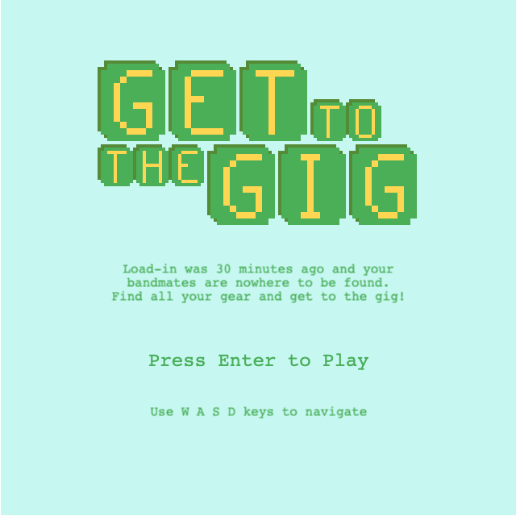
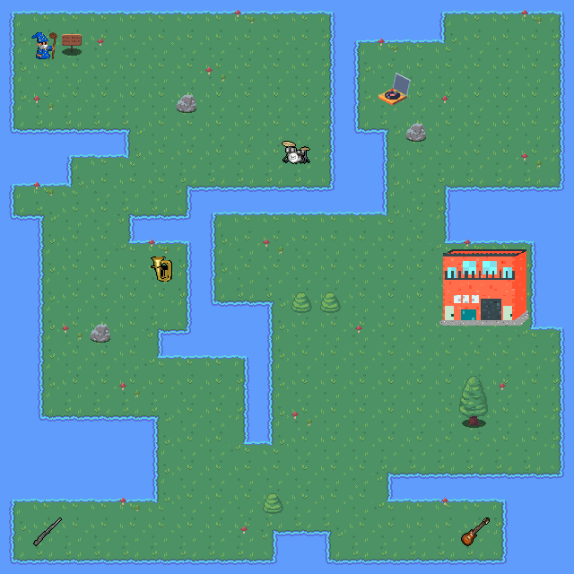

# Get To The Gig

A simple game built with the [Phaser 3](https://phaser.io/) and [Tone.js](https://tonejs.github.io/) frameworks.

## About
I wanted to build a game that utilized music in an interactive way, and in which the music itself was composed via code as oppposed to only playing back audio files. I thought of a quest style game in which the player picks up instruments and a corresponding musical layer is added to the soundtrack.

## The Game
*"Load-in was 30 minutes ago and your bandmates are nowhere to be found. Find all your gear and get to the gig!"*  

The player is presented with a top-down map, with restricted tiles (water) and obstacles (trees & rocks). They must reach the music venue, but can only enter after they've collected all of their gear items. The player navigates with **W A S D** keys. As instruments are collected, a new music layer is added to the soundtrack. Other items (merch) play a sound effect but do not add musical layers. 

## Status
At present, the game is only a simple, single level. My main goals were to:
- build a game with Phaser 3
- utilize Tone.js to compose the game music
- have game mechanics interact with the music
- get some experience using the [Tiled](https://www.mapeditor.org/) map editor
- make some pixel art using [Pixilart](https://www.pixilart.com/)
    - I'm pretty stoked on the [venue graphic](https://raw.githubusercontent.com/mdquigley/gettothegig/master/src/assets/sprites/shea-3d-128.png), based on thee beloved [Shea Stadium BK](http://liveatsheastadium.com/)

Some possible future development may include:
- additional levels (with other venues near and dear to my heart)
- custom sprites for player and items
- Stakes!
    - a countdown to gig time
    - the tempo increases as time left decreases?
    - scores based on time
    - NPCs that interfere with the quest
    - Lasers? magic bolts? to counter NPCs

## Screenshots
### Title Scene

### Level01

## Development Commands

| Command | Description |
|---------|-------------|
| `npm install` | Install project dependencies |
| `npm start` | Build project and open web server running project |
| `npm run build` | Builds code bundle with production settings, publishes to 'docs' for hosting |

## Additional Credits
This project is based on the [Phaser 3 Webpack Project Template](https://github.com/photonstorm/phaser3-project-template).

[Mega Pixel Art 32x32 px. Icons Sprite Sheet](https://vectorpixelstar.itch.io/mega-pixel-art-32x32-px-icons-sprite-sheet) provided by VectorPixelStar ([CC BY-SA](https://creativecommons.org/licenses/by-sa/4.0/deed.en))

[Music icons](https://opengameart.org/content/cc0-music-icons) provided by OpenGameArt ([CC0](https://creativecommons.org/publicdomain/zero/1.0/))

[Wizard sprite](https://opengameart.org/content/wizard-5) provided by OpenGameArt ([CC0](https://creativecommons.org/publicdomain/zero/1.0/))

[RPG Nature Tileset](https://stealthix.itch.io/rpg-nature-tileset) provided by Stealthix ([CC0](https://creativecommons.org/publicdomain/zero/1.0/))

[record_scratch.wav](https://freesound.org/people/ludvique/sounds/71853/) provided by Freesound ([CC0](https://creativecommons.org/publicdomain/zero/1.0/))

[Platform Jump](https://freesound.org/people/Jofae/sounds/362328/) provided by Freesound ([CC0](https://creativecommons.org/publicdomain/zero/1.0/))

Shea Stadium BK sprite by Mike Quigley ([CC BY-SA](https://creativecommons.org/licenses/by-sa/4.0/deed.en))

"Get To The Gig: Level 01" song by Mike Quigley ([CC BY-SA](https://creativecommons.org/licenses/by-sa/4.0/deed.en))
